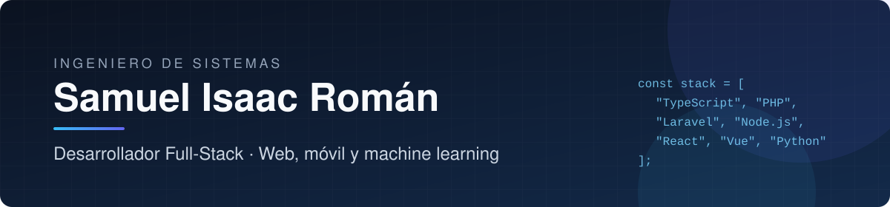

  

  
  
  
  

## Sobre mí

Ingeniero de Sistemas y desarrollador full-stack. Diseño y construyo productos completos: APIs, paneles administrativos, aplicaciones web y móviles para usuarios finales, e integraciones con modelos de machine learning.

Me enfoco en escribir código mantenible y en entregar software que resuelva problemas reales de negocio, desde el modelado de datos hasta la experiencia del usuario.

## Qué aporto

- **Backend:** APIs REST con Laravel y Node.js, y modelado de bases de datos relacionales en MySQL y PostgreSQL.
- **Frontend:** interfaces con React, Vue y Astro, maquetadas con Tailwind CSS.
- **Móvil:** aplicaciones multiplataforma con TypeScript.
- **Machine learning:** modelos de redes neuronales en Python aplicados a la agricultura.

## Tecnologías

| Área | Herramientas |
|---|---|
| Lenguajes |  |
| Frontend |  |
| Backend y datos |  |
| Herramientas |  |

## Proyectos destacados

### HiDriver — Plataforma de envíos

Ecosistema de delivery formado por un backend central, una app para clientes, una app para repartidores y un sitio web.

`PHP` `TypeScript` `Astro`

### AgroScaner — Detección de plagas con redes neuronales

Sistema para la detección y control de plagas en cultivos de arroz en Bagua, Amazonas. Incluye el modelo de red neuronal y la aplicación que lo usa.

`Python` `Jupyter` `TypeScript` · [Ver el modelo](https://github.com/IsaacRoman95/neuronal-network-agroscaner-app)

> La mayoría de mis proyectos son privados por acuerdos con clientes. Puedo mostrar demos o recorrer el código en una entrevista.

## Contacto

Si buscas un desarrollador full-stack para tu equipo o proyecto, escríbeme a **[samuelisaacr@gmail.com](mailto:samuelisaacr@gmail.com)** o por [LinkedIn](https://www.linkedin.com/in/samuelisaacrv).
